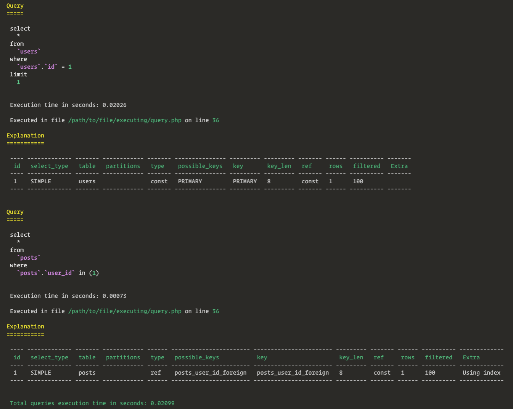
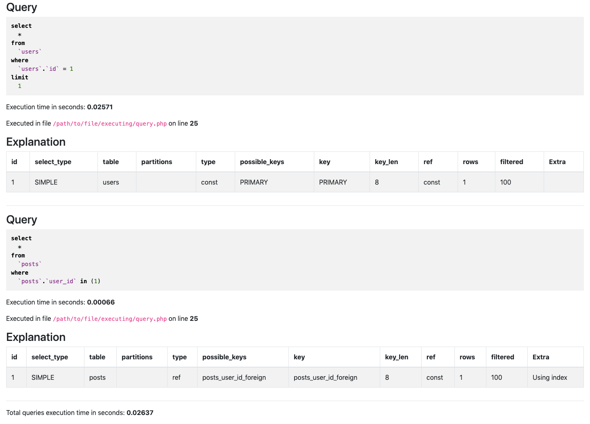

# SQL Dumper

[![Required Laravel Version][ico-laravel]][link-packagist]
[![Required PHP Version][ico-php]][link-packagist]
[![Latest Version on Packagist][ico-version]][link-packagist]
[![Software License][ico-license]](LICENSE.md)
[![Build Status][ico-travis]][link-travis]
[![Coverage Status][ico-scrutinizer]][link-scrutinizer]
[![Quality Score][ico-code-quality]][link-code-quality]
[![Total Downloads][ico-downloads]][link-downloads]

Laravel package to dump SQL queries, related `EXPLAIN` and location in code in different formats:
- HTML
- markdown
- email
- console
- log

## Install

Via Composer

```bash
composer require --dev cerbero/sql-dumper
```

To customize some aspects of this package, the `config/sql_dumper.php` file can optionally be generated via:

```bash
php artisan vendor:publish --tag=sql-dumper
```

## Usage

The easiest way to dump a SQL query is calling the helper functions. There is a helper for each dumper:
- `ds()` dump SQL queries with the dumper specified in `config/sql_dumper.php` as default dumper
- `dsConsole()` dump SQL queries with the console dumper
- `dsEmail()` dump SQL queries with the email dumper
- `dsHtml()` dump SQL queries with the html dumper
- `dsLog()` dump SQL queries with the log dumper
- `dsMarkdown()` dump SQL queries with the markdown dumper

All SQL queries executed within the helper's closure are dumped:

```php
$user = ds(function () {
    return User::with('posts')->find(1);
});
```

Depending on dumper and database driver, SQL queries dumps will look like:
<details>
    <summary>console dump</summary>
    
</details>
<details>
    <summary>email or HTML file or markdown file dump</summary>
    
</details>
<details>
    <summary>log file dump</summary>
    
</details>

---

Along with the default dumper, in `config/sql_dumper.php` we may customize the SQL dumpers default behavior. For example, the HTML dump default path is `/storage/sql_dump_TIMESTAMP.html` but we can set a different one:

```php
return [
    HtmlDumper::class => [
        'path' => storage_path('foo.html'),
    ],
];
```

Also templates and email recipient are customizable, please refer to the [configuration][link-config] for further details.

---

This package includes a middleware to easily dump SQL queries in routes or group of routes. The middleware can be registered in `app/Http/Kernel.php`:

```php
protected $routeMiddleware = [
    'sql.dump' => \Cerbero\SqlDumper\Http\Middleware\SqlDump::class,
];
```

Then we can add it to routes to run the default dumper:

```php
Route::middleware('sql.dump')->get('users', function () {
    return User::all();
});
```

If we want to use a different dumper, we can pass it to the middleware as a parameter:

```php
Route::middleware('sql.dump:log')->get('users', function () {
    return User::all();
});
```

The valid parameters are:
- `console`
- `email`
- `html`
- `log`
- `markdown`

## Change log

Please see [CHANGELOG](CHANGELOG.md) for more information on what has changed recently.

## Testing

``` bash
$ composer test
```

## Contributing

Please see [CONTRIBUTING](CONTRIBUTING.md) and [CODE_OF_CONDUCT](CODE_OF_CONDUCT.md) for details.

## Security

If you discover any security related issues, please email andrea.marco.sartori@gmail.com instead of using the issue tracker.

## Credits

- [Andrea Sartori][link-author]
- [All Contributors][link-contributors]

## License

The MIT License (MIT). Please see [License File](LICENSE.md) for more information.

[ico-laravel]: https://img.shields.io/badge/Laravel-%E2%89%A5%205.6-ff2d20?style=flat-square&logo=laravel
[ico-php]: https://img.shields.io/packagist/php-v/cerbero/sql-dumper?color=%238892BF&style=flat-square&logo=php
[ico-version]: https://img.shields.io/packagist/v/cerbero/sql-dumper.svg?style=flat-square
[ico-license]: https://img.shields.io/badge/license-MIT-brightgreen.svg?style=flat-square
[ico-travis]: https://img.shields.io/travis/cerbero90/sql-dumper/master.svg?style=flat-square&logo=travis
[ico-scrutinizer]: https://img.shields.io/scrutinizer/coverage/g/cerbero90/sql-dumper.svg?style=flat-square&logo=scrutinizer
[ico-code-quality]: https://img.shields.io/scrutinizer/g/cerbero90/sql-dumper.svg?style=flat-square&logo=scrutinizer
[ico-downloads]: https://img.shields.io/packagist/dt/cerbero/sql-dumper.svg?style=flat-square

[link-packagist]: https://packagist.org/packages/cerbero/sql-dumper
[link-travis]: https://travis-ci.org/cerbero90/sql-dumper
[link-scrutinizer]: https://scrutinizer-ci.com/g/cerbero90/sql-dumper/code-structure
[link-code-quality]: https://scrutinizer-ci.com/g/cerbero90/sql-dumper
[link-downloads]: https://packagist.org/packages/cerbero/sql-dumper
[link-author]: https://github.com/cerbero90
[link-contributors]: ../../contributors
[link-config]: ./config/sql_dumper.php
