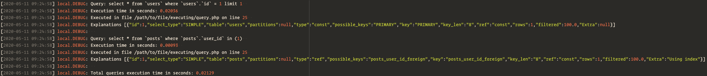

# SQL Dumper

[![Author][ico-author]][link-author]
[![PHP Version][ico-php]][link-php]
[![Laravel Version][ico-laravel]][link-laravel]
[![Build Status][ico-actions]][link-actions]
[![Coverage Status][ico-scrutinizer]][link-scrutinizer]
[![Quality Score][ico-code-quality]][link-code-quality]
[![Latest Version][ico-version]][link-packagist]
[![Software License][ico-license]](LICENSE.md)
[![PSR-12][ico-psr12]][link-psr12]
[![Total Downloads][ico-downloads]][link-downloads]

Laravel package to dump SQL queries, related `EXPLAIN` and location in code in different formats:
- HTML
- markdown
- email
- console
- log

## Install

Via Composer

```bash
composer require --dev cerbero/sql-dumper
```

To customize some aspects of this package, the `config/sql_dumper.php` file can optionally be generated via:

```bash
php artisan vendor:publish --tag=sql-dumper
```

## Usage

The easiest way to dump a SQL query is calling the helper functions. There is a helper for each dumper:
- `ds()` dump SQL queries with the dumper specified in `config/sql_dumper.php` as default dumper
- `dsConsole()` dump SQL queries with the console dumper
- `dsEmail()` dump SQL queries with the email dumper
- `dsHtml()` dump SQL queries with the html dumper
- `dsLog()` dump SQL queries with the log dumper
- `dsMarkdown()` dump SQL queries with the markdown dumper

All SQL queries executed within the helper's closure are dumped:

```php
$user = ds(function () {
    return User::with('posts')->find(1);
});
```

Depending on dumper and database driver, SQL queries dumps will look like:
<details>
    <summary>console dump</summary>
    
</details>
<details>
    <summary>email or HTML file or markdown file dump</summary>
    
</details>
<details>
    <summary>log file dump</summary>
    
</details>

---

Along with the default dumper, in `config/sql_dumper.php` we may customize the SQL dumpers default behavior. For example, the HTML dump default path is `/storage/sql_dump_TIMESTAMP.html` but we can set a different one:

```php
return [
    HtmlDumper::class => [
        'path' => storage_path('foo.html'),
    ],
];
```

Also templates and email recipient are customizable, please refer to the [configuration][link-config] for further details.

---

This package includes a middleware to easily dump SQL queries in routes or group of routes. The middleware can be registered in `app/Http/Kernel.php`:

```php
protected $routeMiddleware = [
    'sql.dump' => \Cerbero\SqlDumper\Http\Middleware\SqlDump::class,
];
```

Then we can add it to routes to run the default dumper:

```php
Route::middleware('sql.dump')->get('users', function () {
    return User::all();
});
```

If we want to use a different dumper, we can pass it to the middleware as a parameter:

```php
Route::middleware('sql.dump:log')->get('users', function () {
    return User::all();
});
```

The valid parameters are:
- `console`
- `email`
- `html`
- `log`
- `markdown`

## Change log

Please see [CHANGELOG](CHANGELOG.md) for more information on what has changed recently.

## Testing

``` bash
$ composer test
```

## Contributing

Please see [CONTRIBUTING](CONTRIBUTING.md) and [CODE_OF_CONDUCT](CODE_OF_CONDUCT.md) for details.

## Security

If you discover any security related issues, please email andrea.marco.sartori@gmail.com instead of using the issue tracker.

## Credits

- [Andrea Sartori][link-author]
- [All Contributors][link-contributors]

## License

The MIT License (MIT). Please see [License File](LICENSE.md) for more information.

[ico-author]: https://img.shields.io/static/v1?label=author&message=cerbero90&color=50ABF1&logo=twitter&style=flat-square
[ico-php]: https://img.shields.io/packagist/php-v/cerbero/sql-dumper?color=%234F5B93&logo=php&style=flat-square
[ico-laravel]: https://img.shields.io/static/v1?label=laravel&message=%E2%89%A55.6&color=ff2d20&logo=laravel&style=flat-square
[ico-version]: https://img.shields.io/packagist/v/cerbero/sql-dumper.svg?label=version&style=flat-square
[ico-actions]: https://img.shields.io/github/workflow/status/cerbero90/sql-dumper/build?style=flat-square&logo=github
[ico-license]: https://img.shields.io/badge/license-MIT-brightgreen.svg?style=flat-square
[ico-psr12]: https://img.shields.io/static/v1?label=compliance&message=PSR-12&color=blue&style=flat-square
[ico-scrutinizer]: https://img.shields.io/scrutinizer/coverage/g/cerbero90/sql-dumper.svg?style=flat-square&logo=scrutinizer
[ico-code-quality]: https://img.shields.io/scrutinizer/g/cerbero90/sql-dumper.svg?style=flat-square&logo=scrutinizer
[ico-downloads]: https://img.shields.io/packagist/dt/cerbero/sql-dumper.svg?style=flat-square

[link-author]: https://twitter.com/cerbero90
[link-php]: https://www.php.net
[link-laravel]: https://laravel.com
[link-packagist]: https://packagist.org/packages/cerbero/sql-dumper
[link-actions]: https://github.com/cerbero90/sql-dumper/actions?query=workflow%3Abuild
[link-psr12]: https://www.php-fig.org/psr/psr-12/
[link-scrutinizer]: https://scrutinizer-ci.com/g/cerbero90/sql-dumper/code-structure
[link-code-quality]: https://scrutinizer-ci.com/g/cerbero90/sql-dumper
[link-downloads]: https://packagist.org/packages/cerbero/sql-dumper
[link-contributors]: ../../contributors
